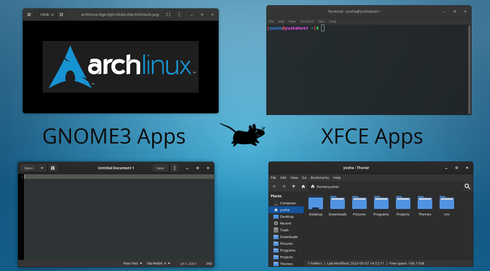

## Adwaita Theme (GNOME 3) for Xfwm4

This is an Adwaita "port" for Xfwm4 made with screenshots from GNOME 3 applications. [View on xfce-look.org](https://www.xfce-look.org/p/2031526). See GNOME 40+ version [here](https://github.com/yusacetin/xfwaita4).

### Screenshot

### Build and Installation

The build files are already included so you can directly install them using `install.sh`. You can install only a specific variant using `install.sh [variant name]`. Variant names are "dark_slim", "dark_large", "light_slim", and "light_large".

Building requires ImageMagick and Python with PIL. Run `build.sh` in the root directory to generate the build files followed by `install.sh` to copy them to your local themes folder, then select one of the variants from Xfce window manager settings under the style tab. You can also do `build.sh [variant name]` to build only a specific variant.

### Uninstallation

Run `uninstall.sh` in the project directory to uninstall all variants or run `uninstall.sh [variant name]` to uninstall a specific variant. Don't forget to select a different theme from settings before you log out.

### Remove border padding

I added border padding in the new version because it was difficult to resize windows. To get the old version, open generate_borders.py and set DARK_BORDER_WIDTH and LIGHT_BORDER_WIDTH to 1 and then build and install.

### Off-centered title workaround

To work around the slightly off-centered window title, place an equal number of window buttons on the left and right sides of the title. For example, if you have the close, maximize, and hide buttons on the right side, you can put the menu, stick, and shade buttons to the left side from Xfce window manager settings. Or try a fork of Xfwm4 that supports full-width title centering.

### License

Screenshots and source images are the same licenses as GNOME and Xfce. Everything else is GNU General Public License version 3.
